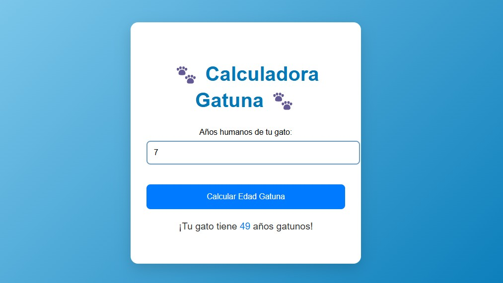

# Calculadora de Edad Gatuna 🐾

## Descripción del Proyecto
Aplicación web interactiva que permite calcular la edad equivalente de un gato en "años gatunos" a partir de su edad humana. Diseñada con un atractivo estilo visual basado en tonos azules y animaciones suaves, la herramienta combina funcionalidad y estética para ofrecer una experiencia de usuario amigable y divertida.

---

## Características Principales
- **Cálculo Inteligente**:  
  Implementa la fórmula estándar de conversión:
  - Primer año humano = 25 años gatunos
  - Cada año adicional = +4 años gatunos

- **Validación de Datos**:  
  Muestra mensajes de error para entradas no válidas (números negativos o caracteres no numéricos).

- **Diseño Responsivo**:  
  Interfaz adaptable a todo tipo de dispositivos con animaciones de aparición (fadeIn).

- **Paleta de Colores**:  
  Degradado azul profesional (#89CFF0 a #0077b6) con detalles en tonos complementarios.
